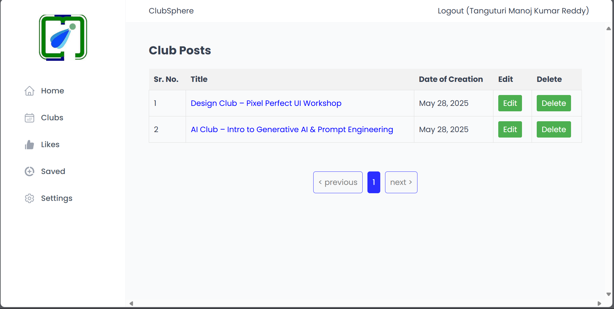

# 🎯 ClubSphere – College Club Management Application


---

## 📌 Overview

**ClubSphere** is a centralized College Club Management Application designed to streamline the communication and engagement process among students involved in various clubs on campus. This application enhances students' college experience by providing a single platform to access and manage posts from all the clubs they follow.

The app is built using **React.js**, **Node.js**, **Express.js**, and **MongoDB**, and is deployed on **Azure**.

---

## 🚀 Live Demo

* 🔗 [Frontend on Azure Static Web Apps](https://your-frontend-app.azurestaticapps.net)
* 🔗 [Backend on Azure App Service](https://your-backend-app.azurewebsites.net)

---

## 🛠️ Key Features

### 🎯 Dashboard for Personalized Updates:

* Users receive a customized dashboard with all posts from their subscribed clubs.
* Ensures quick access to upcoming events, meetings, and announcements.

### 💬 Interactive Post Management:

* Like, comment, share, and bookmark club posts.
* Promotes collaboration and community building.

### 🔖 Save and Bookmark:

* Users can save important posts for later reference.
* Personalized library of saved content improves organization.

### 🔔 Real-Time Notifications:

* Clubs post updates in real time.
* Firebase-based push notifications alert users instantly.

### 🌐 User-Friendly Interface:

* Clean and intuitive UI.
* Simplifies club browsing and user interaction.

---

## 🔐 Authentication & Authorization

* JWT-based login/registration.
* Secure password encryption with **bcrypt**.
* Role-based access for Super Admin, Club Admin, and Users.

---

## 👥 Roles & Permissions

* **Super Admin**: Create clubs and assign Club Admins.
* **Club Admin**: Create/edit/delete/view club posts.
* **User**: Join clubs, interact with posts, save/share content.

---

## 🎉 Benefits

* **📣 Enhanced Communication**: Efficient coordination among club members.
* **🕒 Timely Information**: Instant updates about events and announcements.
* **🤝 Community Engagement**: Liking, commenting, and sharing enhances interaction.
* **📁 Organized Data**: Bookmarking helps retrieve key posts easily.

---

## 🔧 Tech Stack

* **Frontend**: React.js + Tailwind CSS
* **Backend**: Node.js + Express.js
* **Database**: MongoDB
* **Authentication**: JWT + bcrypt
* **Hosting**: Azure Static Web Apps & Azure App Service
* **Notifications**: Firebase

---

## 📷 Screenshots

## 📊 Dashboard
<div align="center">
  
</div>

## 👤 Create Admin
<div align="center">
  
</div>

## 🏛️ Clubs
<div align="center">
  
</div>

## 🛡️ Admin Dashboard
<div align="center">
  
</div>

## ➕ Add Post
<div align="center">
  
</div>

## 💾 Saved Post
<div align="center">
  
</div>

## ❤️ Liked Post
<div align="center">
  
</div>

## ⚙️ Settings
<div align="center">
  
</div>

## 📝 Registration Page
<div align="center">
  
</div>

## 🔐 Login Page
<div align="center">
  
</div>

---

## ✨ Results

* ✅ Fully functional centralized platform for student clubs
* ✅ Enhanced engagement and real-time communication
* ✅ Secure access and personalized user experience

---

## 🧑‍💼 Author

* **Name**: Tanguturi Manoj Kumar Reddy
* **Email**: [20bcs225@iiitdmj.ac.in](mailto:your.email@example.com)


---

## 📢 Contributing

Feel free to fork the repo and create a pull request if you have suggestions or improvements.

```bash
# Clone the project
$ git clone https://github.com/YourGitHub/ClubSphere.git

# Navigate to project folder
$ cd ClubSphere

# Navigate to server folder
$ cd Server

# Install dependencies
$ npm install

# Run the app
$ npm start

# Navigate to client folder
$ cd Cient

# Install dependencies
$ npm install

# Run the app
$ npm run dev
```

---

## 📄 License

This project is licensed under the MIT License.
